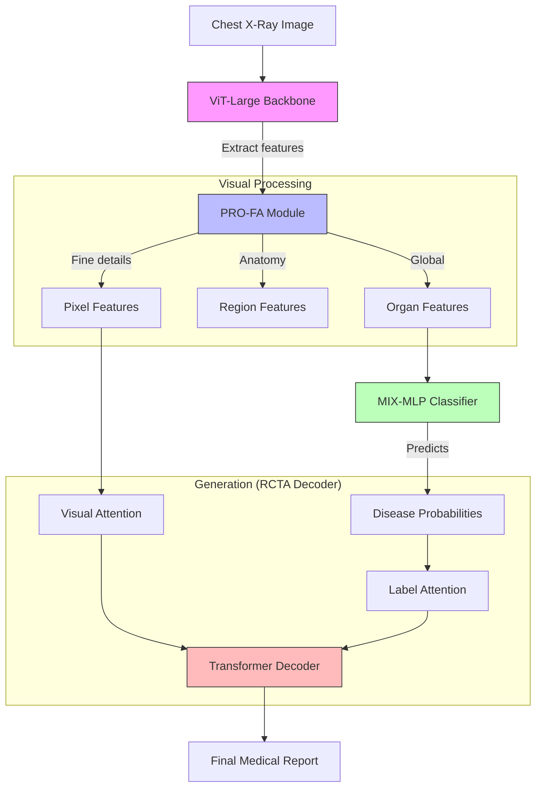
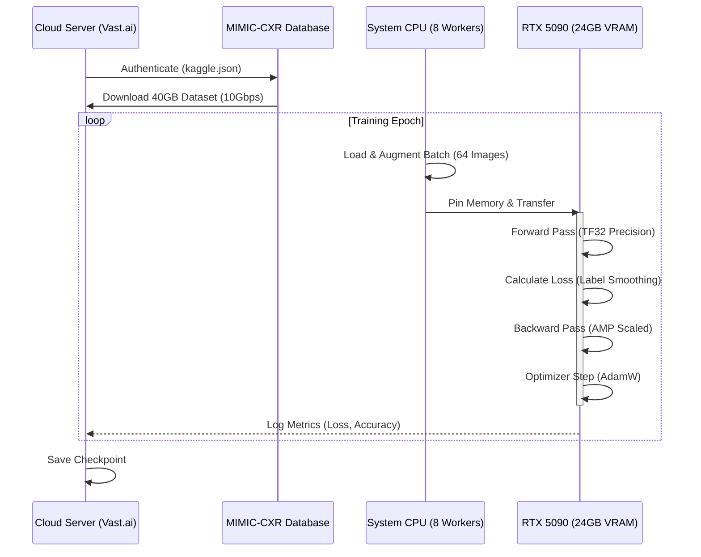
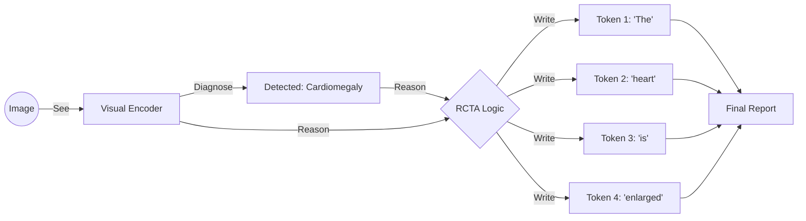

# Cognitive Radiology: Workflow Diagrams

Use these diagrams for your presentation slides.

## 1. High-Level System Architecture

## 2. High-Performance Training Pipeline (RTX 5090)

## 3. Inference Logic (How it "Thinks")

